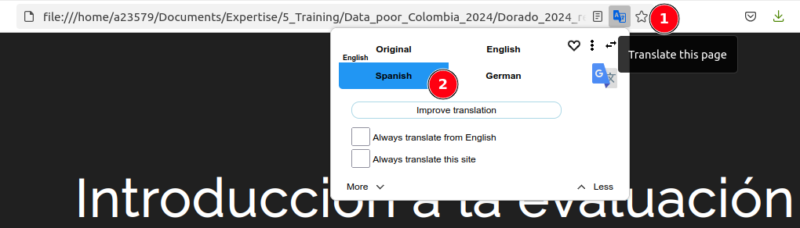

class: center, middle


<!-- Build with: xaringan::inf_mr() -->

```{r preamble, include=FALSE, cache=FALSE}
## source(here::here("imr-2023/preamble.R"))
source(file.path(getwd(), "preamble.R"))
do.call(knitr::opts_chunk$set, knitr_opts)
```

# Versión en español


Hoy en día, la mayoría de los navegadores de Internet ofrecen traducción automática: ¡úselo para la
versión en español!

<br/>



( en Chrome,  o  en
Firefox,...)

---

# Prerequisites


For best experience, and the opportunity to play with the examples, we recommend:

  * to install a [recent version of R](https://cran.rstudio.com/). The following packages used, that need extra installation within R are:
    * [LBSPR](https://github.com/AdrianHordyk/LBSPR) (see also https://adrianhordyk.github.io/LBSPR/articles/LBSPR.html).
    * [tidyverse meta-package](https://www.tidyverse.org/).
    * [sf](https://r-spatial.github.io/sf/), [ggOceanMaps](https://cran.r-project.org/web/packages/ggOceanMaps/index.html).
    * [SPiCT](https://github.com/DTUAqua/spict) (time allowing!).
    * others useful utility packages: cowplot, here, gridExtra, scales, ggFishPlots, ggridges, magrittr,
      nlstools, FSA, fishmethods, R.utils, viridis, mvtnorm [list to be completed...].
  * that you have [Rstudio](https://posit.co/download/rstudio-desktop/) (or similar R editor)
    installed.
  * optionally [install the GIT version control system](https://happygitwithr.com/install-git.html):
    this may help getting updated versions of the course material (but manual download works well too).

We also recommend that you get familiar with different tools ahead of the training. This will ensure
we do not spend to much time troubleshooting during the workshop.

---

# Getting the course material and data

## License and sharing

  * The course is under creative common "CC BY-SA 4.0" license. This means you can share and modify it to your
    liking, as long as you acknowledge the original work:
    
    <small><p xmlns:cc="http://creativecommons.org/ns#" xmlns:dct="http://purl.org/dc/terms/"><span property="dct:title">"Data limited assement training - Cali workshop</span> by <span property="cc:attributionName">Yves Reecht and Hector Antonio Andrade Rodriguez</span> is licensed under <a href="https://creativecommons.org/licenses/by-sa/4.0/?ref=chooser-v1" target="_blank" rel="license noopener noreferrer" style="display:inline-block;">CC BY-SA 4.0</a>"</p></small>

  * The data are provided separately for obvious right reasons. These are not to be shared, unless
    provided on the github repository.

## Links

  * The course material can be found on the following online git repository:
    https://github.com/yreecht/Data-limited_training_Colombia_2025_public (access granted soon before the
    workshop).
  * The data we will be using during the workshop are deposited on
    (https://owncloud.imr.no/index.php/s/kfRLqSTpKFaYwL3) (password: sent by email). Place them in
    the folder 2_Data of your local copy of the repository.


<!-- Local Variables: -->
<!-- coding: utf-8 -->
<!-- ispell-local-dictionary: "english" -->
<!-- fill-column: 100 -->
<!-- End: -->
