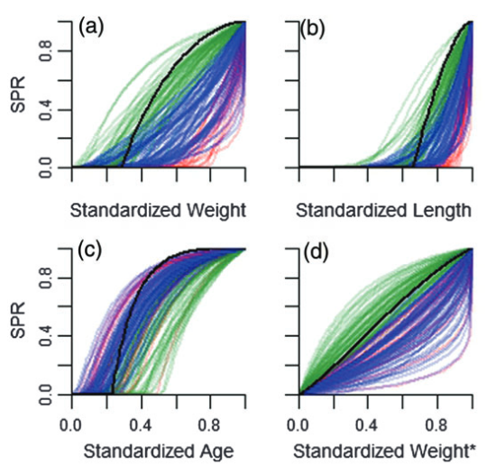
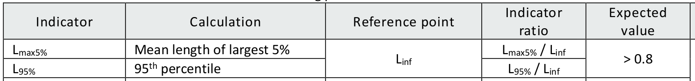

<!-- Build with: xaringan::inf_mr() -->

```{r preamble, include=FALSE, cache=FALSE}
## source(here::here("imr-2023/preamble.R"))
source(file.path(getwd(), "preamble.R"))
do.call(knitr::opts_chunk$set, knitr_opts)
```

```{r libs, include=FALSE}
library(dplyr)
library(tidyr)
library(ggplot2)
library(emo) ## devtools::install_github("hadley/emo")
```
# General introduction

## What is data-limited assessment

A catch-all term, better defined by what it is not:

  * the so-called "gold standard" of assessment - full analytical or data-rich stock assessments,
    which in an ideal case:
  
  "...use catch, abundance indices and biological compositions to produce precise and unbiased
  indicators of stock status for management use." (Cope, 2024)
  
  Often refers to statistical catch at age (SCAA) assessment, but also analytical assessments based
  on production models.
  
.footnote[&emsp;<br /> 
<small>Cope, J. M. 2024. The good practices of practicable alchemy in the
stock assessment continuum: Fundamentals and principles of analytical methods to support
science-based fisheries management under data and resource limitations. Fisheries Research,
270: 106859. https://doi.org/10.1016/j.fishres.2023.106859.

ICES (2012). ICES Implementation of Advice for Data-limited Stocks in 2012 in its 2012 Advice. ICES
Expert Group reports (until 2018). Report. https://doi.org/10.17895/ices.pub.5322 </small>]

--

  * the **numerous** alternatives developed to help providing insight on the stock status and inform
    management, despite poorly informative or sparse data or often referred to as "**data-limited**"
    or "**data-poor**" assessment.

--

  * See also ICES categories ([ICES,
    2012](https://ices-library.figshare.com/articles/report/ICES_Implementation_of_Advice_for_Data-limited_Stocks_in_2012_in_its_2012_Advice/19255148?file=34211615))

---

.pull-left[<br />]


.footnote[<small>ICES (2012). ICES Implementation of Advice for Data-limited Stocks in 2012 in its 2012
Advice. ICES Expert Group reports (until 2018). Report. https://doi.org/10.17895/ices.pub.5322
</small>]

--

.pull-right[&emsp;
<br />...

<br />

.content-box-yellow[Somewhat restrictive!]]

---

## Different entry-points on stock characteristics

The three pilar of stock-assessment (Cope, 2024):


--

  * Status (relative to a reference)
  * Scale (total abundance)
  * Productivity (growth, recruitment, etc.)

--

.content-box-yellow[-> different combinations of data source may inform on the above
  * What they are.
  * How do they change.]


---


.footnote[&emsp;<br /> <small>Cope, J. M. 2024. The good practices of practicable alchemy in the
stock assessment continuum: Fundamentals and principles of analytical methods to support
science-based fisheries management under data and resource limitations. Fisheries Research,
270: 106859. https://doi.org/10.1016/j.fishres.2023.106859.]

---

## Common misconception, challenges

### data-limited ≠ easier!

--

All models are simplifications, some more than others. Data limited assessments tend to rely on more
drastic simplifications as data rich assessments, but their suitability and tractability rely as
much on:

  * **quality and representativeness of data.**
--

  * understanding model assumptions and their adequacy with biology of the population.
--

  * In particular, because their data often rely on more opportunistic and patchy sampling, common
    challenges are:
    * understanding the possible biases in data.
    * mitigation of those biases.
    * orientation among the wealth of different models, with different data requirement and
      assumptions, may be tricky.
--

### How to borrow biological information for under-studied populations?

This is one of the main challenges, and will become the red-thread of this training.

We will introduce life history theory and examples of data gathering in following lectures.

--

.content-box-yellow[Biological information is **critical** for any type of model, from data-rich
(maturity, growth at age) to a qualitative risk assessment (think about slow versus fast growing or
maturing)!]

---

## Sources of uncertainty

Stock assessors have to deal with uncertainty at many levels

--

* Observation (measurement) uncertainty – data type, sampling

--

* Process uncertainty – natural variability in population processes

--

* Model uncertainty – due to model assumptions

--

* Estimation uncertainty – SE of the parameter estimates

--

.content-box-yellow[-> Important because data and model structural limitations increase the reliance
on assumptions over data.

Understanding and characterizing the uncertainty is paramount!]

---

## A wealth of different approaches

  * Catch-based only: weak theoretical basis in general!… tempting, but rather steer-away.

--

  * Biomass estimate + some biological info => expert opinion on safe removal.

--

  * Length-based (LB-SPR, S3, LBI): stronger theoretical basis (most of them at least), but often
    quite constraining assumptions (equilibrium in particular).
--

  * Indicator-based (proxies for variables of management interest reflecting e.g. fish stock, the
    fishery, socio-economic context):
    * rely on reference point(s) (or operational control point(s) - OCP).
    * *e.g.* traffic-light approach (multiple-indicators) `r set.seed(9);emo::ji("light")` 
    * Trigger system / Hierarchical decision tree: trigger management actions based on position
      relative to OCP(s).

--

  * Abundance index-based:
    * Empirical harvest control rules (HCR) based on index (methods which often rely on
      MSEs). Example of ICES guidelines for stock in categories 3-4.
    * State-space surplus production models (SPiCT, Jabba,...). **+Catch based (=> scale)**. 
    
      A bit more data-rich, but limited applicability (need contrast in time-series, an even
      recruitment,...).
--

  * Tag-recapture and other exotic data... possibility to develop an *ad-hoc* model.
  * Other emergent methods (eDNA, etc.)

--

...Or combinations of those!

---
class: middle

# Insight in some useful approaches

Again, just a quick overview!

---

## Length-based approaches

### 1. Underlying theory

  * **Basic principle:** 
  
  Size composition of a catch may tell you something about fishing intensity
  because fishing truncates the population size structure (the bigger ones get caught first usually)

--

  * **But what is the size composition of a pristine population?**
--

    * Life history (how the fish grow, mature, reproduce, die... all the biological rates that
      underpin their life cycle) is the key element here.

    * But most of the time we do not have access to first-hand information on our population's life
      history. How to deal with this shortage of information?
--

    * **life history theory** reveals that information are "connected" so we can borrow information
      across species potentially.
--

    * Beverton–Holt life-history "invariants" (BH-LHI; $L_m/L_{\infty}$, $M/k$, $M \times Age_m$),
      in particular, may be helpful, but they are rather varying together in relation to different
      life-history strategies (Prince *et al.*, 2015; see next slide).

.footnote[<small>Prince, J., Hordyk, A., Valencia, S. R., Loneragan, N., and Sainsbury,
K. 2015. Revisiting the concept of Beverton -Holt life-history invariants with the aim of informing
data-poor fisheries assessment. ICES Journal of Marine Science, 72:
194–203. https://doi.org/10.1093/icesjms/fsu011.</small>]

---

#### Strong reliance on meta-analyses

.pull-left[ ]
.pull-right[Assymptotic growth following Von Bertalanffy growth function:
$L_t = L_{\infty}(1 - e^{-k(t-t_0)})$]

.pull-left[]
.pull-right[.center[]]
<br />

.footnote[<small>Prince, J., Hordyk, A., Valencia, S. R., Loneragan, N., and Sainsbury,
K. 2015. Revisiting the concept of Beverton -Holt life-history invariants with the aim of informing
data-poor fisheries assessment. ICES Journal of Marine Science, 72:
194–203. https://doi.org/10.1093/icesjms/fsu011.</small>]

--

See also the [FishLife `package`](https://github.com/James-Thorson-NOAA/FishLife)

---

#### Size composition of an unfished population (at equilibrium)

.pull-left[]

.pull-right[
* $M/k$ is pivotal in shaping the size composition
* $L_m/L_{\infty}$ determine the proportion mature (first to get erroded by fishing usually).
* $L_{\infty}$ scales the size composition (here with some individual variability => possibility of
  size $> L_{\infty}$)

<br />

**High $M/k$**: individuals grow slowly and die relatively fast<br /> => unlikely to reach $L_{\infty}$.

**Low $M/k$**: relatively fast growing while dying slowly<br /> => build-up number of large individuals at equilibrium.

.footnote[<small>Prince, J., Hordyk, A., Valencia, S. R., Loneragan, N., and Sainsbury,
K. 2015. Revisiting the concept of Beverton -Holt life-history invariants with the aim of informing
data-poor fisheries assessment. ICES Journal of Marine Science, 72:
194–203. https://doi.org/10.1093/icesjms/fsu011.</small>]]

---

## Length-based approaches

### 2. Some examples

#### Length-based indicators (LBI)

<br />

From [Technical Guidelines - ICES reference points for stocks in categories 3 and
4](https://ices-library.figshare.com/articles/report/Technical_Guidelines_-_ICES_reference_points_for_stocks_in_categories_3_and_4/18631637?file=33410942)

---

=> Inform on the **status** of the stock

Reference points usually estimated assuming that $M/k = 1.5$, but may require adjustments as it can be
non-precautionary for different life histories (Miethe et al. 2019)

.footnote[<small>Miethe, T., Reecht, Y., and Dobby, H. 2019. Reference points for the length-based
indicator $L_{max5\%}$<br /> for use in the assessment of data-limited stocks. ICES Journal of Marine Science,
76: 2125–2139. https://doi.org/10.1093/icesjms/fsz158.</small>]

--

.pull-left[

]

--

.pull-right[Effect of fishing <br /> $M/k = 1.5$, $L_{\infty} = 100$, $L_m = L_c = 0.67 \times L_{\infty}$, $F/M=1$:

```{r, echo=FALSE, include=FALSE}
library(LBSPR)
MyPars <- new("LB_pars")
## slotNames(MyPars)
MyPars@L_units <- "cm"

MyPars@BinWidth <- 2
MyPars@BinMax <- 120
MyPars@BinMin <- 0
MyPars@Steepness <- 0.7 # important input values for calculating yield, SSB.
                                        # ... very uncertain though (0.7 is the package default).

MyPars@Linf <- 100
MyPars@MK <- 1.5
MyPars@L50 <- MyPars@Linf * 3 / (3 + MyPars@MK)
MyPars@L95 <- MyPars@L50 + 2 ## ~ knife-edge

MyPars@SL50 <- MyPars@L50
MyPars@SL95 <- MyPars@L95

MyPars@FM <- 1

## plotSize(Len)

sim <- LBSPRsim(MyPars, Control=list(modtype="GTG", ngtg= 30))

## cat("\n$L_{15} = 50$ cm\n\n")
LBSPR::plotSim(sim, lf.type = c("pop"),
               type = c("len.freq"))
## ggplot2::set_last_plot(2)
## test <- last_plot()
```

```{r, echo=FALSE, fig.width=5, fig.height=5, fig.asp=NULL, out.width="70%", results = "asis"}


propCatch <- (1 + exp(-log(19) *
                      (sim@LMids - sim@SL50) / (sim@SL95 - sim@SL50)))^(-1)

idxUF <- which(cumsum(sim@pLPop[ , "PopUF"] * propCatch) / sum(sim@pLPop[ , "PopUF"] * propCatch) > 0.95)

idxF <- which(cumsum(sim@pLPop[ , "PopF"] * propCatch) / sum(sim@pLPop[ , "PopF"] * propCatch) > 0.95)

Lmax5UF <- weighted.mean(sim@pLPop [idxUF, "LMids"], sim@pLPop[idxUF, "PopUF"] * propCatch[idxUF])
Lmax5F <- weighted.mean(sim@pLPop [idxF, "LMids"], sim@pLPop[idxF, "PopF"] * propCatch[idxF])

L95UF <- min(sim@pLPop [idxUF, "LMids"])
L95F <- min(sim@pLPop [idxF, "LMids"])

sizeComp <- as.data.frame(sim@pLPop) %>%
    pivot_longer(PopUF:PopF, names_to = "fished", values_to = "Std_freq") %>%
    left_join(data.frame(LMids = sim@LMids,
                         pMat = (1 + exp(-log(19) *
                                        (sim@LMids - sim@L50) / (sim@L95 - sim@L50)))^(-1),
                         propCatch = (1 + exp(-log(19) *
                                              (sim@LMids - sim@SL50) / (sim@SL95 - sim@SL50)))^(-1))) %>%
    mutate(Std_freq_catch = Std_freq * propCatch,
           prop_mat_catch = Std_freq_catch * pMat,
           prop_mat = Std_freq * pMat, 
           fished = if_else(fished == "PopF", "Fished", "Unfished"))

refPoints <- data.frame(fished = rep(c("Fished", "Unfished"), each = 2),
                        Indicator = rep(c("L[\"95%\"]", "L[\"max5%\"]"), 2),
                        value = c(L95F, Lmax5F, L95UF, Lmax5UF))

library(scales)

ggplot(sizeComp,
       aes(x = LMids, y = Std_freq_catch)) +
    geom_histogram(stat = "identity", aes(colour = "immature", fill = "immature")) +
    geom_histogram(stat = "identity",
                   aes(y = prop_mat_catch, colour = "mature", fill = "mature")) +
    scale_colour_discrete(name = "Mature?",
                          aesthetics = c("colour", "fill")) +
    geom_vline(xintercept = c(0.8 * MyPars@Linf),
               linetype = "solid", colour = "red") +
    geom_vline(xintercept = c(MyPars@Linf, MyPars@L50),
               linetype = "dotted", colour = "red") +
    geom_vline(data = refPoints,
               aes(xintercept = value, linetype = Indicator)) +
    scale_linetype_discrete(labels = parse_format()) +
    xlab("Length") + ylab("Standardized freq") +
    facet_wrap(~fished, ncol = 1)

```

]

---

#### Traffic-light using LBI


How would you fill it? What does it mean?

--


---

## Index-based approaches

Indices are used in numbers of data-limited and data-rich approaches. They will inform primarily on trends.

Usually used in combination with other sources of data

For instance:
* [Empirical harvest control
  rules](https://ices-library.figshare.com/articles/report/ICES_Guidelines_-_Advice_rules_for_stocks_in_category_2_and_3/28506179?file=52813181):
  abundance/biomass indices.
* Surplus production models (SPiCT, Jabba): exploitable biomass indices.
* Statistical catch at age (category 1 or 2): abundance at age, exploitable biomass, etc.

--

<br />
The overall scale usually matters little; the trends and uncertainty do (example here for North Sea saithe):
 
&emsp;&emsp;&emsp;


---

### Empirical harvest rules

.pull-left[
#### empirical approache based on life-history traits - Rfb

Advice based on the stock trend from a biomass index -> ratio `r` last 2 years / previous 3 years:

<large>$$A_{y+1} = A_y \times {\color{red} r} \times f \times b \times m$$</large>

<large>$$r = \frac{\sum_{i=y-2}^{y-1} \color{red}{I_i} / 2}{\sum_{i=y-5}^{y-3} \color{red}{I_i} / 3}  $$</large>


#### Constant harvest rule (chr)

Advice (A) set as a proportion of average historically "safe" catches (C):

<large>$$A_{y+1} = \color{red}{I_{y-1}} \times {HR_{MSY~proxy}} \times b \times m$$</large>

<large>$$HR_{MSY~proxy} = \frac{1}{u} \sum_{y \in U}\frac{C_y}{\color{red}{I_y}}$$</large> ]

.pull-right[
* $f = \frac{\overline{L}_{y-1}}{L_{F=M}}$ is a fishing proxy: <br />
the mean length in the observed catch relative to an MSY proxy length 
($L_{F=M} = 0.75 L_c + 0.25 L_{\infty}$ at $M/k = 1.5$). <br /> 
-> **fishing pressure indicator**

* $b = min\{1, \color{red}{\frac{I_{y-1}}{I_{trigger}}}\}$ is a biomass safeguard  <br />
($I_{trigger} = 1.4 \times I_{loss}$). <br />
 -> **status indicator**

* $m$ is a tuning factor depending on life history, designed to maintain the probability of falling
bellow $B_{lim}$ below 5% <br />
 (**different for different rules**).

* Plus a stability clause: keep year-to-year advice changes within -30% to  +20%!

]

---

#### Example rfb - Norwegian Coastal cod 62-67&deg;N 2023

.pull-left[]

--

.pull-right[


]


---

## Index-based approaches

### How to build a good index

You most likely need
  * a long enough series of data
  * preferably collected using standardized method (regular and consistant survey).
  * that provides data representative of the (portion of the) population you assess (good overlap in
    space **and** time).

If you have a well design survey, the math is rather easy: (possibly-stratified) mean CPUEs may give
a pretty good index.

--

**But this is hardly ever the case!** Chances are that you will have access to fisheries dependent
data of varying quality and coverage in most data-limited cases.

--

This is a wide topic, a whole field by itself:

  * The key word is **standardization**... and it gets complicated when the source of data is not
    consistent in space and time.
  * We recommand taking a proper introduction to underlying statistics, if you are interested.
  * A good hands-on introduction can be found on the sdmTMB R package project pages ([Basic intro
    and other articles](https://pbs-assess.github.io/sdmTMB/articles/basic-intro.html), [teaching
    repository (several courses)](https://github.com/pbs-assess/sdmTMB-teaching), [...see for
    instance this one](https://pbs-assess.github.io/sdmTMB-teaching/imr-2023/)).
  * ...it turns out it is also a very powerful and well maintained statistical package, well suited
    for index standardization.

---

# Take-home messages

Applying an existing model is the easy part once chosen, and the data are formated/compiled. The
real expertise kicks-in at different levels:
--

.content-box-yellow[*Understanding the model(s) assumptions, what they imply, and how
sensitive the outcome is to deviations from these assumptions*] 
.center[.content-box-yellow[*Understanding how representative your data are of the underlying
population, and how it is exploited.*]] 
.center[.content-box-yellow[*Gathering other information relevant for your population: this is
particularly critical for life histories.*]] 
--

.pull-left[.center[.content-box-yellow[**Combine all this information to choose a sensible
approach!**]]
.center[.content-box-yellow[**Understand, propagate and report uncertainty!**]]]

--

.pull-right[.center[.content-box-yellow[**All the above applies for the data-limited model,  
but also for the index you use in the model!**]]]


<!-- > [!NOTE] -->
<!-- > Useful information that users should know, even when skimming content. -->

<!-- > [!TIP] -->
<!-- > Helpful advice for doing things better or more easily. -->

<!-- > [!IMPORTANT] -->
<!-- > Key information users need to know to achieve their goal. -->

<!-- > [!WARNING] -->
<!-- > Urgent info that needs immediate user attention to avoid problems. -->

<!-- > [!CAUTION] -->
<!-- > Advises about risks or negative outcomes of certain actions. -->


<!-- Local Variables: -->
<!-- coding: utf-8 -->
<!-- ispell-local-dictionary: "english" -->
<!-- fill-column: 100 -->
<!-- End: -->
