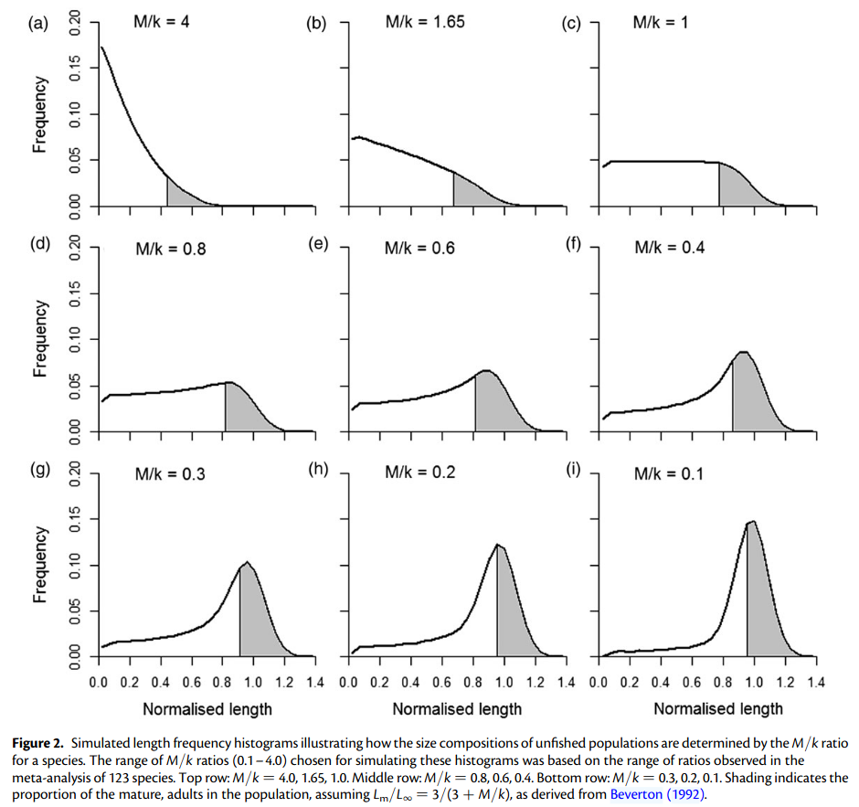

<!-- Layout options and styles -->
```{r preamble, include=FALSE, cache=FALSE}
## source(here::here("imr-2023/preamble.R"))
source(file.path(getwd(), "preamble.R"))
do.call(knitr::opts_chunk$set, knitr_opts)
```
<!-- Packages to load -->
```{r libs, include=FALSE}
library(dplyr)
library(tidyr)
library(ggplot2)
library(LBSPR)
library(DT)
```
# Theoretical basis


---

## Life history "invariants" / theory

.pull-left[
Reminder from last lecture:

* Life history shapes the size composition of a population.

* There are combinations of life history traits (LHT) which are more likely than others.

    * they tend to co-vary with life history strategies (! some of them define these strategies)

    * species from a same group are more likely to share some life history.

    * ...but there may be strong variations within a same taxonomic group

    * [**new**]: there may be large variations within a same species*****!
]

.pull-right[


<small>[(Prince *et al.*, 2015)](https://doi.org/10.1093/icesjms/fsu011).</small>
]<br />

.footnote[[*] A somehow prominent example is the temperature-size rule: phenotypic response which results in
  individuals of a same (ectotherm) species tending to have larger asymptotic sizes ($L_{\infty}$)
  and maturation size when they inhabit colder environments.]

--

  => Beyond the obvious estimation uncertainty, **do not trust blindly any LHT found for the same species**!


---

## Population at equilibrium

.pull-left[At equilibrium (constant recruitment and mortality), 

  * the size composition of the population is mainly shaped by $M/k$ and scaled by $L_{\infty}$.

  * the length at maturity (as a proportion of $L_{\infty}$), will determine how cramped against the
    largest sizes the fraction mature will be.

]

.pull-right[

]

---

.pull-left[
## Population at equilibrium

At equilibrium (constant recruitment and mortality), with fishing, 

  * Selectivity is often considered sigmoidal (i.e. logistic curve)...

  * ...other (non-asymptotic) selectivities could be theoretically used to estimate the equilibrium.

  * the fishing mortality will operate size-selective removal (additional mortality), and, if
    constant, the size composition will tend towards a new equilibrium...
    
    $M/k$ becomes $(M+F)/k$ over $L_c$.

  * If the population is observed from fisheries data, selectivity also affect which fraction of the
population is actually observed (left-truncation) 
]

--
.pull-right[
<br />
<small>from [Sampson (2014)](https://www.sciencedirect.com/science/article/pii/S0165783613002312?via%3Dihub), modified by Kotaro Ono</small>

***


<br />
<small>[(Hordyk *et al.*, 2015)](http://icesjms.oxfordjournals.org/cgi/doi/10.1093/icesjms/fst235)</small>
]

---

### Size compositions (population / observed)...

...with $M/k = 1.5$, $L_{\infty} = 100$ ($CV_{L_{\infty}} = 0.1$), $L_{mat~50\%} = 65$ and $L_{sel~50\%} = 50$: 

```{r, echo = FALSE, eval = TRUE}
library(LBSPR)
library(forcats)
LBparam <- new("LB_pars")

## Population parameters
LBparam@Linf <- 100 # Assymptotic length (Loo)
LBparam@L50 <- 65   # Maturity ogive
LBparam@L95 <- 70   #  -> Lm = 0.65 * Loo
LBparam@MK <- 1.5   # M/k ratio

## Fisheries parameters
LBparam@SL50 <- 50  # Selectivity ogive
LBparam@SL95 <- 65  #  -> Lc = 0.5 * Loo
LBparam@SPR <- 0.4  # The spawning potential ratio at equilibrium.
                    #  Note: the F/M ratio (LBparam@FM) could be used instead.

## Data and simulation parameters:
LBparam@BinWidth <- 5 # LBSPR works with binned data!
LBparam@BinMax <- 150 # > Loo; by default 1.3 * Loo
LBparam@BinMin <- 0

LBsim_04 <- LBSPRsim(LBparam) # Exploited, SPR = 0.4

sizeComp <- as.data.frame(LBsim_04@pLPop) %>%
    pivot_longer(PopUF:PopF, names_to = "fished", values_to = "Std_freq") %>%
    left_join(data.frame(LMids = LBsim_04@LMids,
                         pMat = (1 + exp(-log(19) *
                                        (LBsim_04@LMids - LBsim_04@L50) / (LBsim_04@L95 - LBsim_04@L50)))^(-1),
                         propCatch = (1 + exp(-log(19) *
                                              (LBsim_04@LMids - LBsim_04@SL50) / (LBsim_04@SL95 - LBsim_04@SL50)))^(-1))) %>%
    mutate(Std_freq_Catch = Std_freq * propCatch,
           prop_mat_Catch = Std_freq_Catch * pMat, 
           prop_mat_Population = Std_freq * pMat, 
           fished = fct_rev(factor(if_else(fished == "PopF", "Fished", "Unfished")))) %>%
    rename(Std_freq_Population = Std_freq)

sizeCompAll <- sizeComp %>%
    pivot_longer(c(Std_freq_Catch, Std_freq_Population),
                 names_prefix = c("Std_freq_"),
                 names_to = "Observation_type",
                 values_to = c("Std_freq")) %>%
    mutate(Observation_type = fct_rev(factor(Observation_type)))

sizeCompMat <- sizeComp %>%
    pivot_longer(c(prop_mat_Catch, prop_mat_Population),
                 names_prefix = c("prop_mat_"),
                 names_to = "Observation_type",
                 values_to = c("prop_mat")) %>%
    mutate(Observation_type = fct_rev(factor(Observation_type)))


```
```{r, eval=TRUE, echo = FALSE, results = "asis", fig.asp=6/10, out.width="80%"}

ggplot(sizeCompAll,
       aes(x = LMids, y = Std_freq)) +
    geom_histogram(stat = "identity",
                   aes(colour = "immature", fill = "immature")) +
    geom_histogram(data = sizeCompMat,
                   stat = "identity",
                   aes(y = prop_mat, colour = "mature", fill = "mature")) +
    scale_colour_discrete(name = "Maturity",
                          aesthetics = c("colour", "fill")) +
    xlab("Length") + ylab("Standardized freq") +
    facet_grid(fished~Observation_type)
```

---

### Spawning potential ratio (SPR)

> The spawning potential ratio (SPR) of a stock is defined as the proportion of the unfished reproductive potential left at any given level of fishing pressure. 
[(Hordyk *et al.*, 2015b)](http://icesjms.oxfordjournals.org/cgi/doi/10.1093/icesjms/fsu004)

--

  * largest individuals usually have a larger reproduction potential in fish (fecundity $\propto$
    weight).
    
    *  **=> importance of the weight-length relationships parameters *a* and *b***: $W = aL^b$.

    * Egg production depends on the maturity ogive too: $E \propto Mat_l \times W_l$

--

  * Intuitively: largest individuals have the largest reproductive potential $\times$ selective
    removal of the largest  
    => reduction of reproductive potential.

.pull-left[<br />
<small>[(Hordyk *et al.*, 2015)](http://icesjms.oxfordjournals.org/cgi/doi/10.1093/icesjms/fst235)</small>]

--

.pull-right[Abundante literature about what is a safe SPR:

* Recommended $SPR > 0.4$. But a target at $SPR \in [0.35,0.4]$ is also widely accepted for most life histories.
* $SPR \le 0.2$ is considered unsafe (impaired recruitment).
* But of course depends on the SRR!
]

---

## The LB-SPR model

A model which implement all that, and more*, to calculate a theoretical size composition given a set
of life history traits/"invariants".

Reparametrisation of the logistic curves (fishing selectivity, maturity) for using $L_{50\%}$ and
$L_{95\%}$ (easier to estimate from data, widely available, etc.)

$$S_l = \frac{1}{1 + e^{-ln(19)(l - L_{S50}) / (L_{S95} - L_{S50})}}$$

--

.pull-left[Two important assumptions ensue:

* **=> Fishing selectivity is assumed assymptotic**

* Assumes F applied with the same selectivity as the one supporting the observations.]

--

.pull-right[
$\color{red}{\longrightarrow}$

]

.footnote[[*]
  * compared to sometimes more simplistic size composition models,  
  it includes the effect of
    inter-individual growth variability (instrumental in  
    shaping the right-end of the size
    composition, particularly for low $M/k$).
  * incorporate growth-type-groups to account for differential mortality among individuals with
    different growth (aka "Lee's Phenomenon").
  * implement the possibility of having a size-varying natural mortality ($M/k$ is then defined at
    $L_{\infty}$).
    
    $M_L = M_{L_{\infty}}\left(\frac{L_{\infty}}{L}\right)^c$
]

---

# Implementation - the LBSPR .medium[.remark-code[`R package`]]

To install the package (from CRAN - quite stable, so no need for development version in most cases):

```{r LBSPR_inst, echo=TRUE, eval=FALSE}
install.packages("LBSPR")
```

To get started:

```{r LBSPR_vign, echo=TRUE, eval=FALSE}
library(LBSPR)

vignette("LBSPR")  # Crash-course on the use of LBSPR
```

---

## Setting parameters


```{r LBSPR_set, echo=TRUE, eval=TRUE}
LBparam <- new("LB_pars")

slotNames(LBparam)
```

--

Access a slot using `@`:

```{r LBSPR_set2, echo=TRUE, eval=TRUE}
LBparam@CVLinf
```

---

Setting the main parameters:

```{r LBSPR_set3, echo=TRUE, eval=TRUE}
## Population parameters
LBparam@Linf <- 100 # Assymptotic length (Loo)
LBparam@L50 <- 65   # Maturity ogive
LBparam@L95 <- 70   #  -> Lm = 0.65 * Loo
LBparam@MK <- 1.5   # M/k ratio

## Fisheries parameters
LBparam@SL50 <- 50  # Selectivity ogive
LBparam@SL95 <- 65  #  -> Lc = 0.5 * Loo
LBparam@SPR <- 0.4  # The spawning potential ratio at equilibrium.
                    #  Note: the F/M ratio (LBparam@FM) could be used instead.

## Data and simulation parameters:
LBparam@BinWidth <- 5 # LBSPR works with binned data!
LBparam@BinMax <- 150 # > Loo; by default 1.3 * Loo
LBparam@BinMin <- 0
```


---

## Simulations


```{r LBSPR_sim1, echo=TRUE, eval=TRUE}
LBsim_04 <- LBSPRsim(LBparam) # Exploited, SPR = 0.4

LBparam@SPR <- numeric(0)
LBparam@FM <- 0
LBsim_NF <- LBSPRsim(LBparam) # No fishing, SPR = 1
```
--

```{r LBSPR_sim2, echo=TRUE, eval=TRUE}
## Estimated parameters:
LBsim_04@FM  # F = 2/3 M in exploited case with SPR = 0.4!
LBsim_NF@SPR # SPR estimated =1 inded when F = 0!
```
---

```{r LBSPR_sim3, echo=TRUE, eval=TRUE, results = "asis", fig.asp=6/7, out.width="60%"}
plotSim(LBsim_NF)

```
---

```{r LBSPR_sim4, echo=TRUE, eval=TRUE, results = "asis", fig.asp=6/7, out.width="60%"}
plotSim(LBsim_04)

```

---

## Estimation from empirical size composition

If you have observed size data, **representative** of the size composition of the underlying
population &ndash; assuming that the model assumptions are met and given user-provided life history
traits &ndash; LBSPR can estimate:

 * the most likely SPR,
 * the corresponding F/M.
 * the selectivity ogive (L<sub>S50</sub>, L<sub>S95</sub>) of the fishery/survey, depending on the
   data origin.

...and their confidence intervals.

.full-width[.content-box-yellow[Method: **optimization of SPR** and selectivity so that the
theorethical size composition (given user-provided parameters) fits best the empirical data.]]

---

The package accepts two different formats (+ w/ or wo/ col.names) for empirical size composition data:

.pull-left[Raw data:

```{r, eval=FALSE, echo = TRUE}
LenR <- new("LB_lengths",
            LB_pars = LBparam,
            file = "data/LRaw_MultiYrHead.csv", #<<
            dataType = "raw", header=TRUE)      #<<
```

```{r raw_data, echo=FALSE}
datdir <- DataDir()
df1 <- read.csv(file.path(datdir, "LRaw_MultiYrHead.csv"))
DT::datatable(df1,
              fillContainer = TRUE,
              ##class = "display",
              options = list(pageLength = 25,
                             scrollY = "180px"))

```
]

.pull-right[Binned and tabulated:

```{r binCode, eval=FALSE, echo = TRUE}
LenF <- new("LB_lengths",
            LB_pars = LBparam,
            file = "data/LFreq_MultiYrHead.csv", #<<
            dataType = "freq", header=TRUE)      #<<
```

```{r bin_data, echo=FALSE}

datdir <- DataDir()
df2 <- read.csv(file.path(datdir, "LFreq_MultiYrHead.csv"))
DT::datatable(df2,
              fillContainer = TRUE,
              ## class = "display",
              options = list(pageLength = 25,
                             scrollY = "180px"))
```
]

---


```{r, eval=TRUE, echo = FALSE}
datdir <- DataDir()
LenR <- new("LB_lengths",
            LB_pars = LBparam,
            file = file.path(datdir, "LRaw_MultiYrHead.csv"), #<<
            dataType = "raw", header=TRUE)      #<<
```


```{r, eval=TRUE, echo = TRUE, results = "asis", fig.asp=6/7, out.width="55%"}

plotSize(LB_obj = LenR)

```

---

## Estimation from empirical size composition


```{r, eval=TRUE, echo = TRUE}
fitted <- LBSPRfit(LB_pars = LBparam,
                   LB_lengths = LenR)
```

```{r, eval=TRUE, echo = TRUE}
## Explore the fitted object (> slotNames(fitted) to see the available objects):
fitted@SPR

fitted@FM

fitted@SL50

fitted@Ests  ## parameters estimates smoothed across years...

fitted@Vars  ## ...and their uncertainty
```

---

.pull-left[
```{r, eval=TRUE, echo = TRUE, results = "asis", fig.asp=6/7, out.width="60%"}
plotSize(LB_obj = fitted)

```

```{r, eval=TRUE, echo = TRUE, results = "asis", fig.asp=6/7, out.width="50%"}
plotMat(LB_obj = fitted)

```
]

.pull-right[
```{r, eval=TRUE, echo = TRUE, results = "asis", fig.asp=6/7, out.width="80%"}
plotEsts(LB_obj = fitted)

```
]

---

### Examples of graphic outputs on real data (monkfish in Norway, north of 62&deg;N; credit Kotaro Ono):


---

.pull-left[# Use for management

**A lots of advantages:**

Rely on data that are (relatively) cheap and easy to collect.  
Designed to work best with fisheries-dependent data (size composition equilibrium integrates removal
with selectivity estimated from the data)... observer/self-sampling vs. commisioning a survey
vessel!

Considered quite robust. One of the few models to account for different mortality rates among
individuals of the same age-group growing at different paces ("Lee's phenomeon").

Possibility to estimate (MSY proxy) reference points... if the steepness of the SRR is known.  
(spoiler alerte: it rarely is!)

Simulation tool: quite handy for some applications.
]

.pull-right[
```{r, echo = TRUE, eval = TRUE}
LBparam2 <- LBparam
LBparam2@Steepness <- 0.9

## Re-run with different steepness:
fitted2 <- LBSPRfit(LB_pars = LBparam2,
                    LB_lengths = LenR)

## and then plot exploitation
##  curves using plotCurves(fitted2)
```

```{r, echo = FALSE, eval = TRUE, results = "asis", fig.width = 10, fig.asp= 6/10, out.width="100%", fig.show="hold"}
## Comparisons:
library(cowplot)
plot_grid(plotCurves(fitted, Y = c("SPR", "SSB", "Yield", "YPR")) +
          ggtitle(paste("Steepness =", LBparam@Steepness)) +
          geom_vline(xintercept = 0.75, colour = "red", linetype = "dashed"),
          plotCurves(fitted2, Y = c("SPR", "SSB", "Yield", "YPR")) +
          ggtitle(paste("Steepness =", LBparam2@Steepness)) +
          geom_vline(xintercept = 1.4, colour = "red", linetype = "dashed"),
          ncol = 2)
```
]

--


**=> One of the most popular size-based models nowadays!**

---

## Conditions for applicability

 <br />

Model assumptions will never be fully met, but "close enough" is essential.

 <br />

.full-width[.content-box-yellow[**An important aspect of the expertise resides in evaluating what is
"close enough"!**]]

---

Most important assumptions:

 * **The size distribution is representative** of the population (on the right side). <br /> Quite
   difficult to evaluate, but really essential. <br /> This will often come down to the questions:
   * Is the sampled fraction representative of the whole population?
   * Is the sampling design properly accounted for while raising the size composition? (_E.g._
     stratification if spatial heterogeneity, raising to catch in primary sampling unit, etc.)
   * **Is the gear selectivity asymptotic?** <br /> Although it could theoretically work with
     different patterns, LBSPR assumes an asymptotic selectivity curve.

---

Most important assumptions:

 * **The population is at equilibrium**. <br /> A number of situations may raise concern about this:
   * Recent<sup>1</sup> .footnote[<sup>1</sup>This has to be evaluated in relation to the longevity
     and generation time of the species.] settlement; the population did not have time to reach
     equilibrium.
   * Strong and frequent<sup>1</sup> variations in the exploitation level and or pattern: no time
     for reaching different equilibrium between change.
   * Strong variations (pulses) and/or trends (_e.g._ regime shift, strong auto-correlation in time)
     in the recruitment may also prevent equilibrium.


---

.pull-left[
Most important assumptions:

 * **Relevant life history "invariants"** <br /> LB-SPR is sensitive to parameter misspecifications,
   in particular:

    * $L_{\infty}$: scales everything! <br /> <span style="color:darkred;">Beware of the
      temperature-size rule!!</span>
    * $M/k$: one of the primary parameters controling the shape at equilibrium...
    * ...while $CV_{L_{\infty}}$ controls mostly the right skewness (less sensitive at large $M/k$,
   but rarely known, so very uncertain).  ]

.pull-right[

```{r LBSPR-shapes, echo=FALSE, fig.width=5, fig.height=4.3, fig.asp=NULL, out.width=NULL}

params <- c("Linf", "MK", "CVLinf")

LBparam <- new("LB_pars")

## Population parameters
LBparam@Linf <- 100 # Assymptotic length (Loo)
LBparam@L50 <- 65   # Maturity ogive
LBparam@L95 <- 70   #  -> Lm = 0.65 * Loo
LBparam@MK <- 1.5   # M/k ratio

## Fisheries parameters
LBparam@SL50 <- 50  # Selectivity ogive
LBparam@SL95 <- 65  #  -> Lc = 0.5 * Loo
LBparam@SPR <- numeric(0)
LBparam@FM <- 0

## Data and simulation parameters:
LBparam@BinWidth <- 5 # LBSPR works with binned data!
LBparam@BinMax <- 250 # > Loo; by default 1.3 * Loo
LBparam@BinMin <- 0

sizeComp_sensitivity <- function(param, LBparam, fact = c(0.8, 1.2),
                                 relSL = FALSE, relL = FALSE)
{
    ## Purpose:
    ## ----------------------------------------------------------------------
    ## Arguments:
    ## ----------------------------------------------------------------------
    ## Author: Yves Reecht, Date: 11 Feb 2025, 10:53

    library(dplyr)
    library(tidyr)

    LBbase <- LBSPRsim(LBparam)

    res1 <- cbind(as.data.frame(LBbase@pLPop),
                  param = param,
                  fact = "base")

    res2 <- sapply(fact,
                   function(fa, LBpar = LBparam)
            {
                slot(LBpar, param) <- slot(LBparam, param) * fa
                if (! param %in% c("SL50", "SL95") && isTRUE(relSL))
                {
                    LBpar@SL50 <- LBparam@SL50 * LBpar@Linf / LBparam@Linf
                    LBpar@SL95 <- LBparam@SL95 * LBpar@Linf / LBparam@Linf
                }
                if (! param %in% c("L50", "L95") && isTRUE(relL))
                {
                    LBpar@L50 <- LBparam@L50 * LBpar@Linf / LBparam@Linf
                    LBpar@L95 <- LBparam@L95 * LBpar@Linf / LBparam@Linf
                }
                LBres <- LBSPRsim(LBpar)
                res <- cbind(as.data.frame(LBres@pLPop),
                             param = param,
                             fact = paste0(ifelse(fa > 1, "+", ""),
                                           round(100 * (fa - 1)),
                                           "%"))
            }, simplify = FALSE)

    res <- bind_rows(c(list(res1), res2))

}

library(forcats)

dfSa <- c(sapply(params[1:2],
                 sizeComp_sensitivity,
                 LBparam = LBparam,
                 fact = c(0.8, 1.2),
                 simplify = FALSE),
          sapply(params[3],
                 sizeComp_sensitivity,
                 LBparam = LBparam,
                 fact = c(0.5, 2),
                 simplify = FALSE))%>%
    bind_rows() %>%
    mutate(Value = fct_relevel(fact, c("base", "-50%", "-20%", "+20%", "+100%")),
           param = fct_relevel(param, params)) %>%
    group_by(param, fact) %>%
    mutate(PopFstd = PopF / max(PopF),
           VulnUFstd = VulnUF / max(VulnUF))

dfSaLong <- dfSa %>%
    pivot_longer(c(PopFstd, VulnUFstd),
                 values_to = "Relative_abundance",
                 names_to = "Variable") %>%
    mutate(Variable = fct_recode(Variable, Population = "PopFstd", Catch = "VulnUFstd"))


ggplot(dfSaLong, aes(x = LMids, y = Relative_abundance, colour = Value, linetype = Value)) +
    geom_line() +
    facet_grid(param ~ Variable) +
    xlim(c(0, 150)) +
    theme_bw() +
    xlab("Size") + ylab("Relative abundance") +
    ggtitle("Theoretical size compositions")

```
]

--
 <br />

.center[.content-box-yellow[You should always well document your LHT choices, and perform a
sensitivity analysis]]

---

## Empirical evidence / success

Empirical evidence is quite difficult to gather, as evaluating management strategies in the real world takes a long time, but:

--

* growing portfolio of documented success stories (*e.g.* Prince *et al.*, 2020), despite the relatively young
  age of the model implementation (~10 years).

* based on strong theoretical fundations.
  
  (I hope I managed to convinced you of that one!)

* tested and validated using MSE (refs.)

=> widely used, and endorsed by scientifc organisations such as ICES.


<br />
***
<small>Prince, J., Creech, S., Madduppa, H., and Hordyk, A. 2020. Length based assessment of spawning
potential ratio in data-poor fisheries for blue swimming crab (Portunus spp.) in Sri Lanka and
Indonesia: Implications for sustainable management. Regional Studies in Marine Science,
36: 101309. https://doi.org/10.1016/j.rsma.2020.101309.  </small>

---

## Known limitations

It also has a few flaws:

* reliance on the equilibrium assumption is strong.

* only implemented for an asymptotic, mono-modal fisheries selectivity, while dome-shaped
  selectivity is not-uncommon.

* sensitivity to input parameters, some of which are quite uncertain in most cases (refs.)... that
  is true of so many assessment methods, including data rich, though!

* as of now, not able to impose some correlation on estimates among years (*e.g.* selectivity, if
  one knows that practices/fishing patterns are not changing much among years).

* may "spit" seemingly consistent results, however poor one's choice of data and LHT is.


<!-- Local Variables: -->
<!-- coding: utf-8 -->
<!-- ispell-local-dictionary: "english" -->
<!-- fill-column: 100 -->
<!-- End: -->
