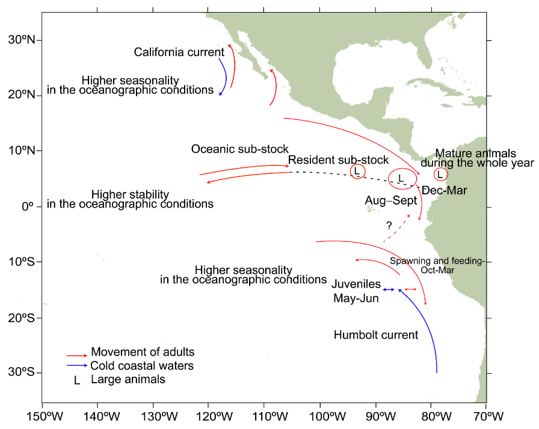

<!-- Layout options and styles -->
```{r preamble, include=FALSE, cache=FALSE}
## source(here::here("imr-2023/preamble.R"))
source(file.path(getwd(), "preamble.R"))
do.call(knitr::opts_chunk$set, knitr_opts)
```
<!-- Packages to load -->
```{r libs, include=FALSE}
library(dplyr)
library(tidyr)
library(ggplot2)
library(LBSPR)
```

# Life history and relevance of model assumptions

  * Fast growth ($k = 1.3$) and high natural mortality ($M = 1.26$) => rather typical $M/k \approx 1$.

--

  * Early maturation (3-7 months), around 65 cm (55 cm fork-length; estimated using a GLMM).

--

  * In equatorial region, reproduction and growth throughout the year...

    * ...but fishery is seasonal in Colombia (Nov.-Mar.)

    * What about seasonality in fishing by other countries?

--

  **=> Is the equilibrium assumption reasonable?**<br />

<br />

.content-box-yellow[Importance to look at how the size composition and estimates vary through the fishing season!]


---

## A mobile population:


.pull-left[


<small>Conceptual model of Dorado spatial distribution and movements, from a regional workshop in
2016, from [Minte-Vera *et al.*
(2024)](https://linkinghub.elsevier.com/retrieve/pii/S0165783624001991)</small>
]

--

.pull-right[

* Are the data **representative of the underlying population size composition?**

* Is the selectivity in Colombian waters **representative of the selectivity in other fisheries affecting the stock?**
]


<!-- Local Variables: -->
<!-- coding: utf-8 -->
<!-- ispell-local-dictionary: "english" -->
<!-- fill-column: 100 -->
<!-- End: -->
