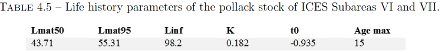

<!-- Layout options and styles -->
```{r preamble, include=FALSE, cache=FALSE}
source(file.path(getwd(), "preamble.R"))
do.call(knitr::opts_chunk$set, knitr_opts)
```
<!-- Packages to load -->
```{r libs, include=FALSE}
library(dplyr)
library(tidyr)
library(readr)
library(boot)
library(ggplot2)
library(LBSPR)
```

# Background


.pull-left[European pollock (*Pollachius pollachius*) is a gadoid which

  * is a **popular recreative-fishing target**
  * and **occasionally important commercial bycatch**. <br /> 

  * subject to very little regulation in Norwegian waters, 
  * little is known about the health of the stock (only evaluated for IUCN redlist).
  * other stocks, further south (Celtic Sea), assessed and known to be in bad shape.
  * regular landings and sampling in the gilnet fishery (coastal reference fleet).
]

.pull-right[ <br /> <br />
 <br />
credit Citron / CC-BY-SA-3.0]

<br />
Request in 2021: what are the options to ensure the stock is well managed / not overfished?

---

# Available data

## Commercial sampling


## Survey data


---

# Life history traits

Under-studied species, especially in Norwegian waters!

.pull-left[Some information available, but not necessarily regionally relevant.

  * [**Fishbase**](https://www.fishbase.se/summary/Pollachius_pollachius.html)

Variable quality of estimates, limited information on parameter variability... better than nothing,
but we have to keep uncertainty in mind.]
.pull-right[
]
<br />

  * **Celtic Sea**

Most comprehensive regional data set, from a PhD thesis (Alemany, 2017)... just not the "right" region!



<small>Juliette Alemany. Development of a Bayesian framework for data limited stock assessment
methods and management scenarios proposal. Case studies of cuttlefish (Sepia officinalis) and
pollack (Pollachius pollachius). Agricultural sciences. Normandie
Université, 2017. English. 263pp. NNT : 2017NORMC229</small>

---

# Life history traits

Under-studied species, especially in Norwegian waters!

Some information available, but not necessarily regionally relevant.

  *  **Institute's data**

.pull-left[Some maturity stage data from a coastal gillnet survey. Regionally relevant, but at a time of
the year when staging is uncertain (long after and before spawning).

=> Likely underestimation of the proportion mature at size (*i.e.* parameters shifted to the right;
might be more precautionary).]

.pull-right[
Binomial GLM (see exercise scripts):

```{r, echo=FALSE, fig.width=4, fig.height=3, fig.asp=NULL, out.width="80%"}

dataMaturity <- read_csv(file = "../2_Data/Pollock_maturity_data_clean.csv")

glmAll <- glm(formula = mature_bin ~ length_cm,
              family = "binomial",
              data = dataMaturity)

glmMF <- glm(formula = mature_bin ~ length_cm * sex,
             family = "binomial",
             data = dataMaturity)


## For real application, we would do a whole lot of model validation checks here...
##   but we ignore them for this training, as this is merly an example.

## Predictions from the model:

## 1) create prediction grids:
dataPredictS <- expand_grid(length_cm = seq(from = round(min(dataMaturity$length_cm)),
                                           to = round(max(dataMaturity$length_cm)),
                                           by = 0.5),
                            sex = c("M", "F"))

dataPredictA <- expand_grid(length_cm = seq(from = round(min(dataMaturity$length_cm)),
                                           to = round(max(dataMaturity$length_cm)),
                                           by = 0.5),
                            sex = c("All"))

## 2) collate them with predictions from the model:
predAll <- bind_cols(list(dataPredictA,
                          ## Predictions using the grid:
                          predict(glmAll,
                                  newdata = dataPredictA,
                                  se.fit = TRUE, type = "link"))) %>%
    ## Back transformation (prediction in the logit space):
    mutate(mat = inv.logit(fit),
           mat_low = inv.logit(fit - 1.96 * se.fit),
           mat_upp = inv.logit(fit + 1.96 * se.fit),
           type = "Pooled")

predMF <- bind_cols(list(dataPredictS,
                         predict(glmMF,
                                 newdata = dataPredictS,
                                 se.fit = TRUE, type = "link"))) %>%
    mutate(mat = inv.logit(fit),
           mat_low = inv.logit(fit - 1.96 * se.fit),
           mat_upp = inv.logit(fit + 1.96 * se.fit),
           type = "By sex")

ggplot(data = bind_rows(predAll, predMF),
       aes(x = length_cm, y = mat, colour = sex, fill = sex)) +
    geom_ribbon(aes(ymin = mat_low, ymax = mat_upp),
                alpha = 0.4, colour = NA) +
    geom_line() +
    ylab("Proportion mature") +
    facet_wrap(~type, ncol = 1) +
    theme_bw()

```
]

---

# Life history traits

## Compilation

<table width="80%" cellpadding="0" cellspacing="0">
	<col width="60"/>
	<col width="185"/>
	<col width="161"/>
	<col width="160"/>
	<tr valign="top" >
		<td width="60" style="border: 0px solid #000000; padding: 0cm 0.19cm">
			<br/>
		</td>
		<td width="185" style="border: 0px solid #000000; padding: 0cm 0.19cm">
			<br/>
		</td>
		<td width="161" style="border: 1px solid #000000; padding: 0cm 0.19cm">
			“<font size="2" style="font-size: 10pt"><b>FishBase” set</b></font>
		</td>
		<td width="160" style="border: 1px solid #000000; padding: 0cm 0.19cm">
			“<font size="2" style="font-size: 10pt"><b>Celtic Sea” set</b></font>
		</td>
	</tr>
	<tr valign="top" height="1px">
		<td width="60" style="border: 1px solid #000000; padding: 0cm 0.19cm">
			<font size="2" style="font-size: 10pt"><b>Parameter</b></font>
		</td>
		<td width="185" style="border: 1px solid #000000; padding: 0cm 0.19cm">
			<font size="2" style="font-size: 10pt"><b>Description</b></font>
		</td>
		<td width="161" style="border: 1px solid #000000; padding: 0cm 0.19cm">
			<font size="2" style="font-size: 10pt"><b>mean (variability)</b></font>
		</td>
		<td width="160" style="border: 1px solid #000000; padding: 0cm 0.19cm">
			<font size="2" style="font-size: 10pt"><b>mean (variability)</b></font>
		</td>
	</tr>
	<tr>
		<td width="60" valign="top" style="border: 1px solid #000000; padding: 0cm 0.19cm">
			<font size="2" style="font-size: 10pt">Linf</font>
		</td>
		<td width="185" valign="top" style="border: 1px solid #000000; padding: 0cm 0.19cm">
			<font size="2" style="font-size: 10pt">Asymptotic length (cm)</font>
		</td>
		<td width="161" style="border: 1px solid #000000; padding: 0cm 0.19cm; text-align: center">
			<font size="2" style="font-size: 10pt">85.6 (CV=0.1) </font><sup><font size="2" style="font-size: 10pt">a</font></sup>
		</td>
		<td width="160" style="border: 1px solid #000000; padding: 0cm 0.19cm; text-align: center">
			<font size="2" style="font-size: 10pt">98.2 (CV=0.1) </font><sup><font size="2" style="font-size: 10pt">b</font></sup>
		</td>
	</tr>
	<tr>
		<td width="60" valign="top" style="border: 1px solid #000000; padding: 0cm 0.19cm">
			<font size="2" style="font-size: 10pt">CVLinf</font>
		</td>
		<td width="185" valign="top" style="border: 1px solid #000000; padding: 0cm 0.19cm">
			<font size="2" style="font-size: 10pt">Variability asymptotic
			length</font>
		</td>
		<td colspan="2" width="335" style="border: 1px solid #000000; padding: 0cm 0.19cm; text-align: center">
			<font size="2" style="font-size: 10pt">0.1 (CV=0.1) </font><sup><font size="2" style="font-size: 10pt">c,†</font></sup>
		</td>
	</tr>
	<tr>
		<td width="60" valign="top" style="border: 1px solid #000000; padding: 0cm 0.19cm">
			<font size="2" style="font-size: 10pt">k</font>
		</td>
		<td width="185" valign="top" style="border: 1px solid #000000; padding: 0cm 0.19cm">
			<font size="2" style="font-size: 10pt">Growth coefficient (1/y)</font>
		</td>
		<td width="161" style="border: 1px solid #000000; padding: 0cm 0.19cm; text-align: center">
			<font size="2" style="font-size: 10pt">0.186 (CV=0.1) </font><sup><font size="2" style="font-size: 10pt">a</font></sup>
		</td>
		<td width="160" style="border: 1px solid #000000; padding: 0cm 0.19cm; text-align: center">
			<font size="2" style="font-size: 10pt">0.182 (CV=0.1) </font><sup><font size="2" style="font-size: 10pt">b</font></sup>
		</td>
	</tr>
	<tr>
		<td width="60" valign="top" style="border: 1px solid #000000; padding: 0cm 0.19cm">
			<font size="2" style="font-size: 10pt">M</font>
		</td>
		<td width="185" valign="top" style="border: 1px solid #000000; padding: 0cm 0.19cm">
			<font size="2" style="font-size: 10pt">Natural mortality (1/y)</font>
		</td>
		<td colspan="2" width="335" style="border: 1px solid #000000; padding: 0cm 0.19cm; text-align: center">
			<font size="2" style="font-size: 10pt">0.34 (CV=0.1) </font><sup><font size="2" style="font-size: 10pt">b</font></sup>
		</td>
	</tr>
	<tr>
		<td width="60" valign="top" style="border: 1px solid #000000; padding: 0cm 0.19cm">
			<font size="2" style="font-size: 10pt">Lm50</font>
		</td>
		<td width="185" valign="top" style="border: 1px solid #000000; padding: 0cm 0.19cm">
			<font size="2" style="font-size: 10pt">Length 50% maturity (cm)</font>
		</td>
		<td width="161" style="border: 1px solid #000000; padding: 0cm 0.19cm; text-align: center">
			<font size="2" style="font-size: 10pt">47.64 (sd=0.32) </font><sup><font size="2" style="font-size: 10pt">‡</font></sup>
		</td>
		<td width="160" style="border: 1px solid #000000; padding: 0cm 0.19cm; text-align: center">
			<font size="2" style="font-size: 10pt">43.71 (CV=0.1) </font><sup><font size="2" style="font-size: 10pt">b</font></sup>
		</td>
	</tr>
	<tr>
		<td width="60" valign="top" style="border: 1px solid #000000; padding: 0cm 0.19cm">
			<font size="2" style="font-size: 10pt">Lm95</font>
		</td>
		<td width="185" valign="top" style="border: 1px solid #000000; padding: 0cm 0.19cm">
			<font size="2" style="font-size: 10pt">Length 95% maturity (cm)</font>
		</td>
		<td width="161" style="border: 1px solid #000000; padding: 0cm 0.19cm; text-align: center">
			<font size="2" style="font-size: 10pt">Lm95-Lm50=11.00 (sd=0.62)</font><sup><font size="2" style="font-size: 10pt">
			‡</font></sup>
		</td>
		<td width="160" style="border: 1px solid #000000; padding: 0cm 0.19cm; text-align: center">
			<font size="2" style="font-size: 10pt">55.31 (CV(Lm95-Lm50)=0.1) </font><sup><font size="2" style="font-size: 10pt">b</font></sup>
		</td>
	</tr>
	<tr>
		<td width="60" valign="top" style="border: 1px solid #000000; padding: 0cm 0.19cm">
			<font size="2" style="font-size: 10pt">Ls95-Ls50</font>
		</td>
		<td width="185" valign="top" style="border: 1px solid #000000; padding: 0cm 0.19cm">
			<font size="2" style="font-size: 10pt">logistic selectivity par.
			(cm)</font>
		</td>
		<td colspan="2" width="335" style="border: 1px solid #000000; padding: 0cm 0.19cm; text-align: center">
			<font size="2" style="font-size: 10pt">16.32 (sd=1.38) </font><sup><font size="2" style="font-size: 10pt">*</font></sup>
		</td>
	</tr>
	<tr>
		<td width="60" valign="top" style="border: 1px solid #000000; padding: 0cm 0.19cm">
			<font size="2" style="font-size: 10pt">a</font>
		</td>
		<td width="185" valign="top" style="border: 1px solid #000000; padding: 0cm 0.19cm">
			<font size="2" style="font-size: 10pt">weight-Length rel. a</font>
		</td>
		<td colspan="2" width="335" style="border: 1px solid #000000; padding: 0cm 0.19cm; text-align: center">
			<font size="2" style="font-size: 10pt">0.0089 (sd log10=0.2907) </font><sup><font size="2" style="font-size: 10pt">a</font></sup>
		</td>
	</tr>
	<tr>
		<td width="60" valign="top" style="border: 1px solid #000000; padding: 0cm 0.19cm">
			<font size="2" style="font-size: 10pt">b</font>
		</td>
		<td width="185" valign="top" style="border: 1px solid #000000; padding: 0cm 0.19cm">
			<font size="2" style="font-size: 10pt">weight-Length rel. exponent
			b </font>
			
		</td>
		<td colspan="2" width="335" style="border: 1px solid #000000; padding: 0cm 0.19cm; text-align: center">
			<font size="2" style="font-size: 10pt">3.02 (sd=0.1646) </font><sup><font size="2" style="font-size: 10pt">a</font></sup>
		</td>
	</tr>
</table>

<small>References: <sup>a</sup> Fishbase, <sup>b</sup> Alemany (2017), <sup>c</sup> Hordyk *et al.* (2015).<br />

<sup>†</sup> LBSPR default.<br />
<sup>‡</sup> Own data (gillnet survey), model-based.<br />
<sup>*</sup> Estimated from empirical fit from reference fleet; used in simulations only
</small>

---

# Time for reflexion...

Would you trust an assessment based solely on an empirical LBSPR fit? Why?


How would you approach a minimum size advice?

Clues:
  * think of what biology tells us; 
  * try to rely less on commercial data! <br /> 

  * what is a high fishing mortality?
  * what spawning potential is considered safe?

--

<br />
.center[.content-box-yellow[What is a minimum landing size that ensures a healthy stock even if we fish hard?]]

---

# Chose approach

**"Stochastic"-LBSPR**: we simulate the uncertainty of life histories.

**Three-steps approach**:

--

  1. Simulation of life histories using data compiled above.

--

  2. Fit LBSPR to gillnet fisheries data
    * -> Stock status/pressure for each simulated LHT set (propagation of uncertainty).
    * -> estimation of actual fishery selectivity.
--

  3. Simulation of SPR for a range of F/M and minimum landing size (Ls15) for each simulated set of
     LHT

     => Exploration of which F/M - Minimum size are precautionnary? 

--


---

# Gillnet fishery selectivity / stock status "Fishbase"?


---

# Gillnet fishery selectivity / stock status "Celtic Sea"?


---

# Simulation results

<p>
"Fishbase" &emsp;&emsp;&emsp;


</p>

<p>
"Celtic Sea" &emsp;&emsp;&emsp;


</p>

---

# Uncertainty

## Status based on LBSPR:

  * based on LHT mostly from other regions
  * very little information about actual uncertainty of the parameters => educated guess at best!
  * the two datasets give different enough pictures
    
    => very wide uncertainty for both SPR and F/M.
--

  * Also assumption uncertainties:
    * how representative of fisheries in general? Recreative fishing likely targetting smaller individuals.
    * is the catchability assymptotic? Possibly dome shaped (different habitat preferences for larger individuals).

--

.content-box-yellow[* Status very uncertain, should not rely on it!
<br />
* Selectivity estimates are consistent.]

---

# Uncertainty

## Minimum size estimates:

  * based on LHT mostly from other regions
  * very little information about actual uncertainty of the parameters => educated guess at best!
  * the two datasets give different enough pictures
--

  * Also assumption uncertainties:
    * how representative of fisheries in general? Recreative fishing likely targetting smaller individuals.
    * is the catchability assymptotic? Possibly dome shaped (different habitat preferences for larger individuals).
--

  * **BUT...**
    * increased uncertainty => wider intervals => more likely to identify a minimum landing size as non-precautionary.
    * not fisheries dependent *per se*. 
--

<br />
.content-box-yellow[A good indicator that it is likely precautionary to fish hard with a minimum size of 50 cm or above]

---


```{r, echo=FALSE, fig.width=12, fig.height=4, fig.asp=NULL, out.width="70%", results = "asis"}
library(LBSPR)
MyPars <- new("LB_pars")
## slotNames(MyPars)
MyPars@L_units <- "cm"
MyPars@Species <- "pollock"

MyPars@BinWidth <- 2
MyPars@BinMax <- 145
MyPars@BinMin <- 0
MyPars@Steepness <- 0.7 # important input values for calculating yield, SSB.
                                        # ... very uncertain though (0.7 is the package default).

MyPars@Linf <- 98.2 # (Alemany 2017) ## 85.6 # (FB)  => sensitivity analysis required
MyPars@L50 <- 43.71 # (Alemany 2017)
MyPars@L95 <- 55.31 # (Alemany 2017)
MyPars@MK <- 1.866 # (Alemany 2017)  ## M/K

## All years together for now, but enough data to split by year:
Len <- new("LB_lengths", LB_pars=MyPars, file="./2_Data/Length_gillnets_all.csv",
           dataType="raw", header = TRUE)

dlmm <- 55.31 - 43.71 # L95-L50
SL15 <- 50

MyPars@SL50 <- SL15 + dlmm * log(1 / 0.15 - 1) / log(19)
MyPars@SL95 <- MyPars@SL50 + dlmm

MyPars@FM <- 3

## plotSize(Len)

sim <- LBSPRsim(MyPars, Control=list(modtype="GTG", ngtg= 30))

dlmm <- 55.31 - 43.71 # L95-L50
SL15 <- 40

MyPars@SL50 <- SL15 + dlmm * log(1 / 0.15 - 1) / log(19)
MyPars@SL95 <- MyPars@SL50 + dlmm

MyPars@FM <- 3

## plotSize(Len)

sim2 <- LBSPRsim(MyPars, Control=list(modtype="GTG", ngtg= 30))

cat("\n$L_{15} = 40$ cm\n\n")
LBSPR::plotSim(sim2, lf.type = c("pop"),
               type = c("len.freq", "maturity.select", "yield.curve"),
               perRec = FALSE)

cat("\n$L_{15} = 50$ cm\n\n")
LBSPR::plotSim(sim, lf.type = c("pop"),
               type = c("len.freq", "maturity.select", "yield.curve"))

cat(" \n ")
```

<br />

---

# Shortcomings


---

# Conclusions


<!-- Local Variables: -->
<!-- coding: utf-8 -->
<!-- ispell-local-dictionary: "english" -->
<!-- fill-column: 100 -->
<!-- End: -->
